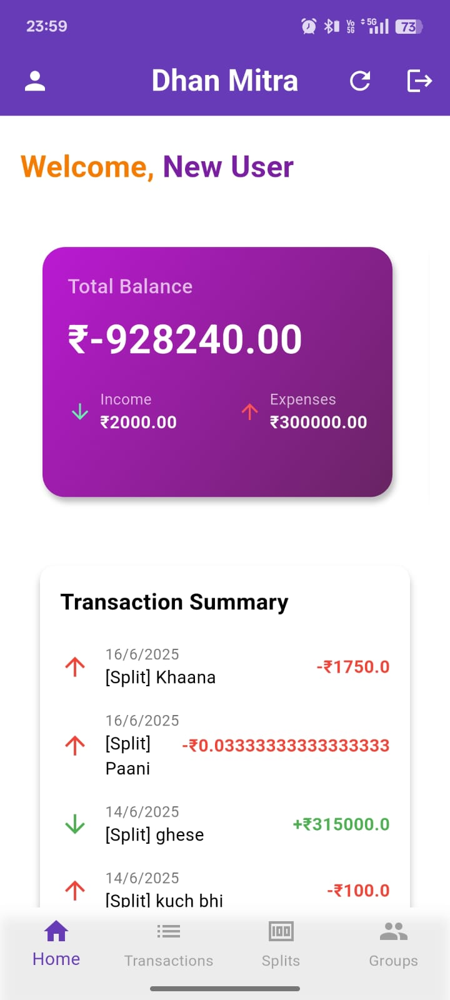
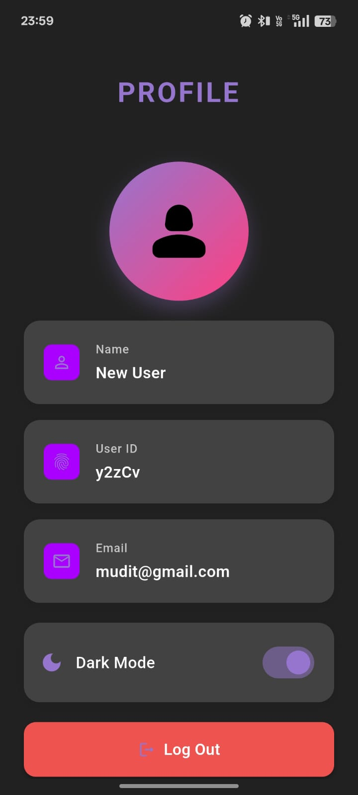
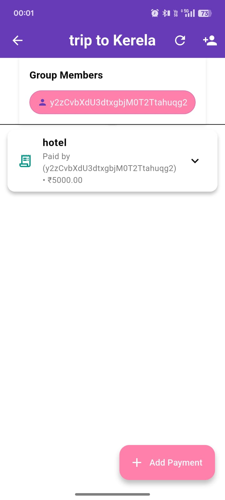
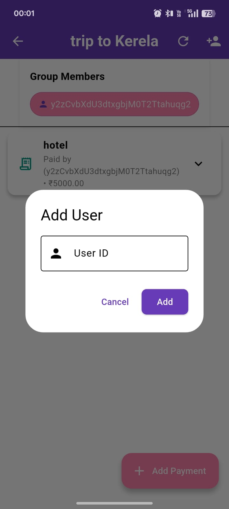

# 📱 Dhan-Mitra [Advanced Personal Finance App]

**Dhan Mitra** is a mobile app built using **Flutter** and **Firebase** to simplify group expense tracking. It allows users to create groups, add transactions, and split payments equally or with custom amounts. The app calculates who owes whom and supports real-time settlements for trips and events.

---

## 🚀 Features

- ✅ Clean and intuitive UI  
- 🔒 Secure authentication (Firebase/Local)  
- 📊 Real-time data updates  
- 🧾 Proper & Real-time Expense Tracking  
- 👥 Group-based Payments and Easy Settlements  
- 💰 Summary of Owed and Pending Amounts  

---

## 🖼️ Screenshots

| Home Screen | Profile | Group Page |
|-------------|---------|-------------|
|  |  |  |

| Splits Page | Add User |
|-------------|----------|
|  |  |

---

## 🛠️ Tech Stack

- **Flutter** – Frontend Framework  
- **Firebase** – Backend, Auth, Realtime DB, Google Login  
- **Dart** – Core programming language  
- **Provider / Bloc** – State Management  

---

## 📦 Installation

```bash
git clone https://github.com/yourusername/yourapp.git
cd yourapp
flutter pub get
flutter run
